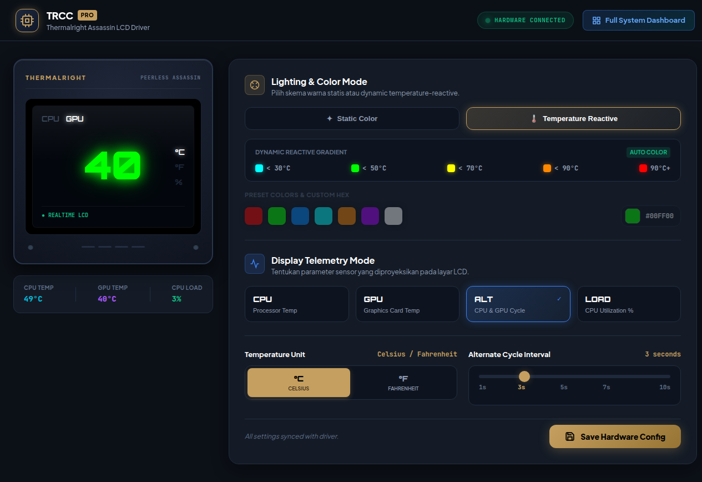
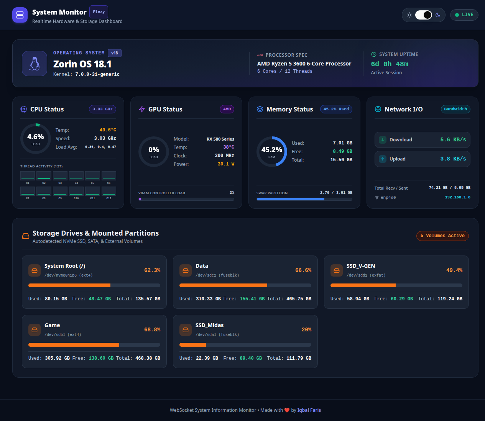

# Thermalright Assassin LCD Driver & System Monitor for Linux

[](https://kernel.org)
[](https://www.python.org)
[](https://react.dev)
[](https://tailwindcss.com)
[](https://opensource.org/licenses/MIT)

Linux driver, modern web control center (TRCC), and comprehensive real-time system monitoring dashboard for **Thermalright Peerless Assassin Digital / Royal Pretor LCD** CPU coolers.

---

## 📸 Screenshots

### 🎛️ TRCC Control Center (Port `5000`)
Interactive physical cooler preview and hardware LCD control panel.


### 📊 Full System Monitor Dashboard (Port `5000/dashboard/`)
Real-time WebSocket telemetry dashboard with dark mode, storage monitoring, and network I/O tracking.


---

## ✨ Features

### 1. Thermalright LCD Driver & Control Center (`/`)
- **Realtime Digital Display Preview:** Physical shroud visualization with live 7-segment digital display rendering.
- **Dynamic Color Modes:**
  - `Temperature Reactive`: Automatically shifts colors based on temperature thresholds (<30°C Cyan, <50°C Green, <70°C Yellow, <90°C Orange, 90°C+ Red).
  - `Static Color`: Custom HEX color picker and curated vibrant presets (Red, Green, Blue, Cyan, Orange, Purple, White).
- **Telemetry Display Modes:**
  - `CPU`: Live CPU package temperature.
  - `GPU`: Live dedicated/integrated GPU temperature.
  - `ALT`: Automated alternating cycle between CPU and GPU temperatures.
  - `LOAD`: Live CPU utilization percentage.
- **Precision Interval Slider:** Configurable cycle intervals (1s, 3s, 5s, 7s, 10s) with accurate mathematical alignment.
- **Unit Selector:** Seamless switching between Celsius (`°C`) and Fahrenheit (`°F`).
- **Zero-Polling Web Interface:** Instant responsive controls communicating directly with the background daemon.

### 2. Full Suite Real-Time Dashboard (`/dashboard/`)
- **Operating System & Kernel Telemetry:** OS distro banner, Linux kernel version, CPU architecture, and system uptime.
- **Core Hardware Status:**
  - **CPU:** Real-time load doughnut chart, clock speed, package temperature, 3-tier load averages (1m, 5m, 15m), and per-thread bar indicators (up to 12+ threads).
  - **GPU:** Real-time GPU utilization, temperature, core clock, power consumption (Watts), and VRAM controller load (AMD / NVIDIA support).
  - **Memory:** RAM usage breakdown (Used, Free, Total) with Swap partition indicator.
  - **Network I/O:** Realtime bandwidth speed (Upload & Download in KB/s & MB/s), total cumulative transferred traffic (Recv / Sent in GB), active interface identifier, and local IP address.
- **Multi-Storage Drive Monitoring:** Automatic discovery and visual capacity breakdown for all mounted disks/partitions (`/`, external SSDs, NVMe, NTFS/exFAT mounts).
- **Theme Support:** Clean Dark Mode & Light Mode toggle with instant state persistence.

---

## 🚀 Installation

Clone this repository and run the automated modular installer:

```bash
git clone https://github.com/iqbalfaris24/thermalright-assassin-linux.git
cd thermalright-assassin-linux
chmod +x install.sh
sudo ./install.sh
```

### Installation Options:
The installer will prompt you to choose your desired setup mode:

```text
Select Installation Mode:
  [1] Standard Mode (LCD Driver & TRCC Web Interface only)
  [2] Full Suite Mode (LCD Driver + Full System Monitor Dashboard) [Recommended]
```

- **Standard Mode:** Installs the core Python USB driver and the TRCC Web Control Center.
- **Full Suite Mode:** Builds the modern React 19 + Tailwind SPA dashboard and unifies everything into a single lightweight service on port `5000`.

---

## 🌐 Accessing the Interfaces

Once installed, the system service starts automatically:

| Interface | URL | Description |
| :--- | :--- | :--- |
| **TRCC Web Panel** | `http://localhost:5000/` | Hardware LCD configuration and lighting controls |
| **System Dashboard** | `http://localhost:5000/dashboard/` | Full-screen real-time hardware telemetry dashboard |

*(You can also access both interfaces from any device on your local network using your machine's IP address, e.g., `http://192.168.1.8:5000/`)*

---

## ⚙️ Service Management

The background driver and web server are managed via systemd:

```bash
# Check service status
sudo systemctl status thermalright-lcd

# Restart service (after manual updates)
sudo systemctl restart thermalright-lcd

# Stop service
sudo systemctl stop thermalright-lcd

# View real-time logs
sudo journalctl -u thermalright-lcd -f
```

---

## 🛠️ Development & Building Frontend

If you want to customize the dashboard interface:

```bash
cd dashboard-ui
npm install
npm run build   # Compiles to dashboard-ui/dist/
sudo systemctl restart thermalright-lcd
```

---

## 📄 License

This project is licensed under the [MIT License](LICENSE).
